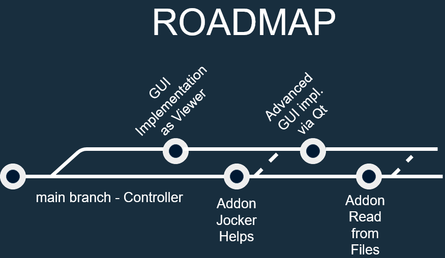

# WWM-Console-Sandbox

WINDOWS ONLY as for now(!!)

Clone of famous quiz TV show to experiment with while learning C++

Little Console-Quiz with 15 hard-coded trivial questions created as a base controller to further build on with GUI and File input.

Below you see the sketched out roadmap how I plan to expand this app

the Console "GUI" will remain in the main branch with the controller

The Window-Based GUI will be added in an independent separate branch and migrated later to DirectX and in far future to Qt-Framework (Community Edition)

Additional functionalities will be added onto the main branch Controller and made accessible to the Gui branch

